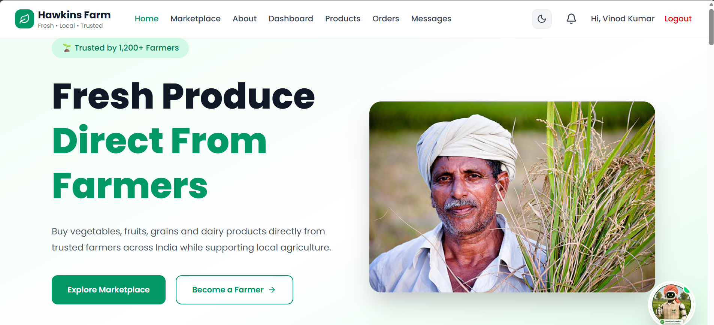
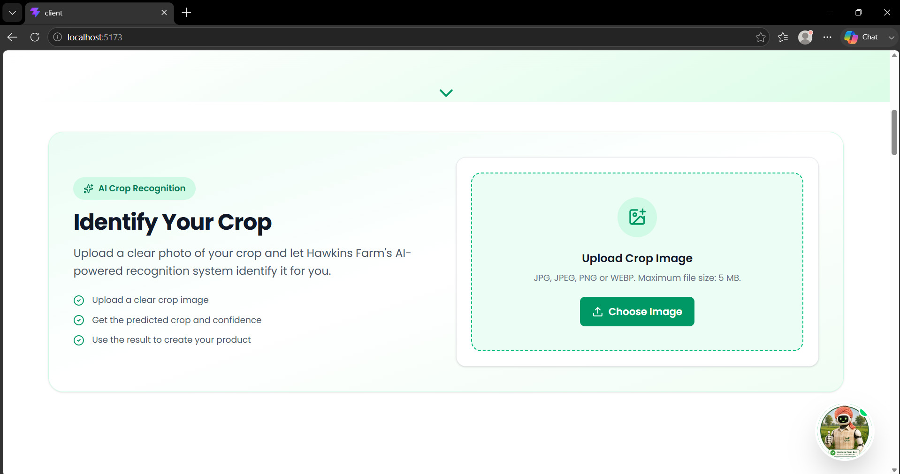
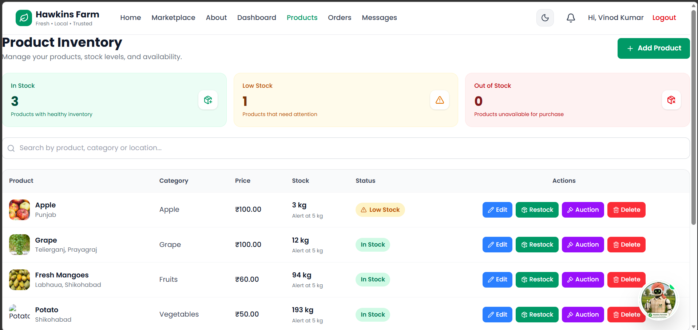
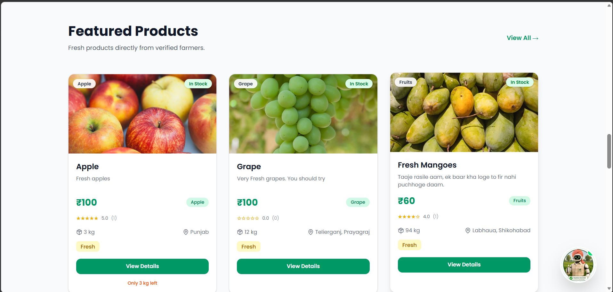

# 🌾 Hawkins Farm

> **AI-powered digital marketplace for farmers and buyers**

🔗 **Live Demo:** https://hawkins-frontend.onrender.com

Hawkins Farm is a **full-stack, role-based agricultural marketplace** designed to connect farmers and buyers through a unified digital platform. The system provides product discovery and management, cart and order processing, online payments, real-time farmer-buyer communication, live auctions, reviews, notifications, and administrative management.

The platform is extended with **AI/ML-based crop recognition, an agriculture-focused AI assistant, and location-based weather services**, combining conventional web application architecture with real-time and AI-driven functionality.

---

## 📸 Project Preview

<p align="center">
  
  
  
  
</p>

---

## ✨ Features

### 🛒 Marketplace & Product Management

- 🔍 Product discovery with search and filtering
- 📦 Product, pricing, inventory, availability, and rating management
- 👨‍🌾 Farmer-side product CRUD operations
- 🖼️ Cloudinary-based product image storage
- ⭐ Product reviews and ratings

### 👥 Role-Based Access

- 👨‍🌾 Dedicated Farmer, Buyer, and Admin dashboards
- 🔐 JWT-based authentication and role-based authorization
- 🛡️ Protected frontend routes and REST API endpoints

### 🔨 Real-Time Auctions

- 🏷️ Farmer-created product auctions
- 💰 Buyer bidding with real-time updates
- ⚡ Socket.IO-based bid synchronization
- ⏱️ Automated auction expiry and lifecycle management
- 🏆 Winning bid and auction result tracking

### 💬 Real-Time Communication

- 🤝 Farmer-buyer private messaging
- ⚡ WebSocket communication using Socket.IO
- 🔔 Real-time notifications and updates
- 💾 Persistent chat history through REST APIs

### 🌱 AI Crop Recognition

The platform can identify crops/commodities from an uploaded image using a trained deep-learning classification model.

**Current model:**

- MobileNetV3Small
- TensorFlow / Keras
- Image classification
- 49 crop/commodity classes
- FastAPI inference endpoint

Example:

```json
{
  "crop": "Cucumber",
  "confidence": 45.26
}
```

The current dataset contains **4,596 images across 49 classes**.

Example classes include:

`Apple`, `Mango`, `Tomato`, `Potato`, `Rice`, `Wheat`, `Cucumber`, `Carrot`, `Brinjal`, `Cabbage`, `Cauliflower`, `Grapes`, `Orange`, `Papaya`, `Pomegranate`, `Peanut`, `Moong`, `Masur Dal`, `Tur Dal`, and many more.

### 🌦️ Weather Integration

- 📍 Location-based weather search via **Open-Meteo**
- 🌡️ Current and feels-like temperature
- 💧 Humidity, precipitation, and rainfall data
- 💨 Wind speed and direction
- 📅 7-day weather forecasting
- 🔌 Backend-mediated weather API integration

### 🤖 AI Farming Assistant

- 💬 Agriculture-focused conversational assistant
- 🌱 Crop and farming guidance
- 🌦️ Weather and market-related assistance
- 🧠 AI-powered agricultural recommendations

### 💳 Cart, Orders & Payments

- 🛒 Cart and checkout management
- 📦 Order creation, tracking, and cancellation
- 💳 Razorpay payment integration
- 🧾 Invoice generation
- 🔄 Order lifecycle management

### 🔐 Authentication & Security

- 🔑 JWT-based authentication
- 🔒 bcrypt password hashing
- 👤 Role-based authorization
- 🛡️ Protected React routes and REST APIs
- 🌐 CORS configuration
- 🔐 Environment-based credential management

### 🛠️ Administration

- 👥 User management
- 📦 Product management
- 🛒 Order management
- ⭐ Review management
- 🔐 Admin-only protected operations

---

## 🛠️ Tech Stack

### Frontend

- React.js
- Vite
- Redux Toolkit
- React Router DOM
- Axios
- Tailwind CSS
- Lucide React
- Socket.IO Client

### Backend

- Node.js
- Express.js
- MongoDB
- Mongoose
- REST APIs
- Socket.IO
- JWT
- bcrypt
- Multer
- Cloudinary
- Razorpay
- Nodemailer
- dotenv

### AI / ML

- Python
- FastAPI
- TensorFlow / Keras
- Machine Learning
- Image Classification

### External Services

- MongoDB Atlas
- Cloudinary
- Razorpay
- Open-Meteo
- AI/ML Service

---

## 🏗️ System Architecture

```text
                         ┌──────────────────────────┐
                         │     Farmer / Buyer       │
                         │         / Admin          │
                         └────────────┬─────────────┘
                                      │
                                      ▼
                    ┌───────────────────────────────┐
                    │       React + Vite            │
                    │                               │
                    │  Redux Toolkit • React Router │
                    │  Axios • Tailwind CSS         │
                    └──────────────┬────────────────┘
                                   │
                         REST API  │  Socket.IO
                                   │
                                   ▼
                    ┌───────────────────────────────┐
                    │      Node.js + Express        │
                    │                               │
                    │  Auth • Products • Cart       │
                    │  Orders • Payments • Reviews  │
                    │  Auctions • Chat • Weather   │
                    │  Notifications • Admin       │
                    └───────┬───────────┬───────────┘
                            │           │
                  ┌─────────┘           └──────────────┐
                  ▼                                    ▼
        ┌──────────────────┐                 ┌──────────────────┐
        │   MongoDB Atlas  │                 │ External Services│
        │                  │                 │                  │
        │ Users            │                 │ Cloudinary       │
        │ Products         │                 │ Razorpay         │
        │ Orders           │                 │ Open-Meteo       │
        │ Auctions         │                 │ Nodemailer       │
        │ Reviews & Chats  │                 └──────────────────┘
        └──────────────────┘
                            │
                            │ AI/ML API
                            ▼
                   ┌──────────────────────┐
                   │   Python AI/ML       │
                   │      Service         │
                   │                      │
                   │ FastAPI              │
                   │ TensorFlow / Keras   │
                   │ Crop Recognition     │
                   └──────────────────────┘
```
